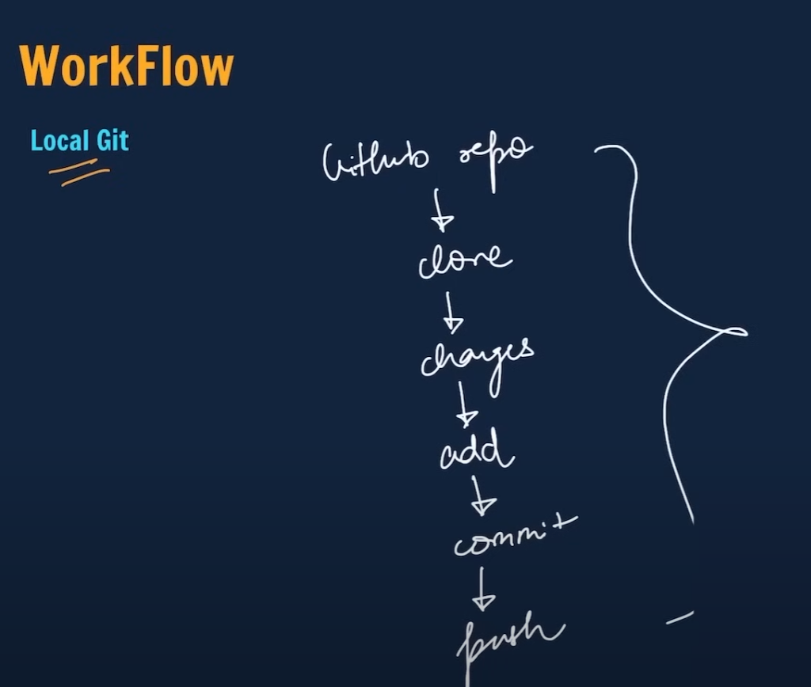

# Testing local repo for the second time since I am a dummy and didn't get it the first time.

#Workflow

git pull origin main <pull everything from Github>
git add . <add all the new changes/files>
git commit -m "message you wanna add to this update"
git push <push everything to github>

#Reset/Undo Changes
Git reset <file name only if you want to reset one file not everything> <this only works if you already did the add command but didn't commit.>
Git reset HEAD~1 <reset latest commit, head means latest commit>
Git reset <commit hash> <find it through log>
Git reset --hard <commit hash> <will reset in VS code as well>

Git log <check all commits>

#Branches
git branch <to check which branch you are in>
git branch -M <new branch name> <to rename the branch>
git checkout -b <new branch name>
git checkout <brand name you want to switch to>
git brand -d <branch name you want to delete>
git diff <branch name you want to compare>
git merge <branch you want to merge>

#Fork (make copy of any github repo)
Do it on github

Note: Need to learn #Markdown